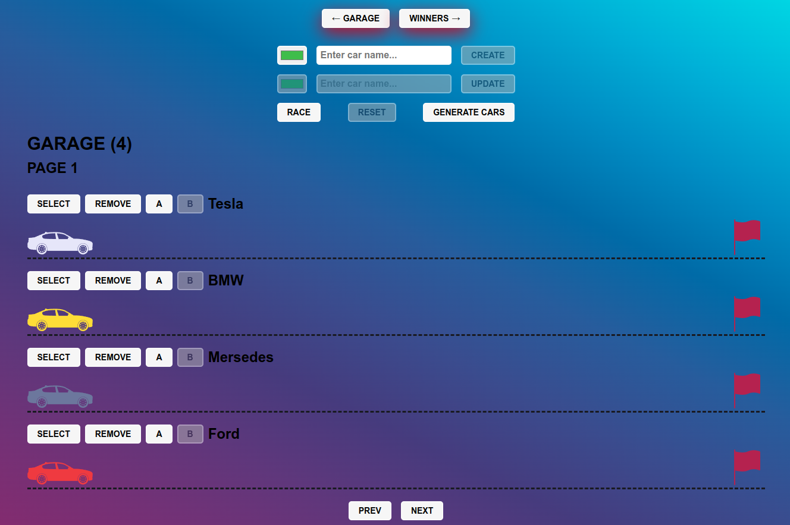

# Async Race

SPA created using communication with a server (fetch, REST API), async coding / promises and JS animations.
[Task description](https://github.com/rolling-scopes-school/tasks/blob/master/tasks/async-race.md)


## Deploy

https://alexpashchuk-async-race.netlify.app/

Back-end is deployed to the free of charge common server, it needs time to wake up. Please be patient and wait for a minute until the website is uploaded.
The Deployed version of the app is already connected to deployed server. 

To run the deployed version, install and start the server [Install Server Api](#back-end)

## Back-End server

https://github.com/alexpashchuk/async-race/tree/server-api

## Install instructions:

To see the functionality of the app, server should be running in the meantime. Server-mock is in the branch server-api.

### Front-End:

```bash
1. git clone https://github.com/alexpashchuk/async-race.git
2. cd async-race
3. npm i
4. npm run start
```

### Back-End:

```bash
1. git clone https://github.com/alexpashchuk/async-race.git
2. cd async-race
3. git checkout server-api
4. npm i
5. npm run start
```

### Used technologies

- JavaScript
- TypeScript
- CSS
- Rest API
- Webpack
- Eslint
- JS animations

## Screenshot


